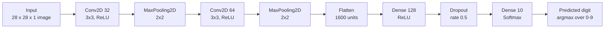

# Handwritten digit recognition using neural network.

A convolutional neural network (Keras/TensorFlow) that classifies handwritten digits (0-9) from the MNIST-style CSV dataset in `datasets/Train.csv`.

The project has three parts:

- `handwritten-digit-recognition.ipynb` - trains the model on `datasets/Train.csv` and  saves it to `mnist_model.keras`.
- `mnist_ui_local_model.py` - a Tkinter paint app to draw a 28x28 digit and evaluate against local model.

The typical workflow is: train once, draw a digit and export it, then predict.

## Training pipeline (Steps 1-10)

`handwritten-digit-recognition.py` is organized into ten numbered steps that take the raw CSV all the way to a trained, saved model plus sample predictions. The diagram below shows that flow end to end.

```mermaid
flowchart LR
    S1["Step 1: Import libraries<br/>numpy, pandas, sklearn, tensorflow, matplotlib"]
    S2["Step 2: Load and explore the dataset<br/>read datasets/Train.csv, split into X (pixels) and y (labels)"]
    S3["Step 3: Preprocess the data<br/>to numeric, fill missing, normalize /255, reshape to 28x28x1"]
    S4["Step 4: One-Hot encode the labels<br/>y to 10-class vectors via to_categorical"]
    S5["Step 5: Split the data<br/>train_test_split -> 80% train / 20% validation"]
    S6["Step 6: Build the neural network model<br/>Conv2D 32 -> Pool -> Conv2D 64 -> Pool -> Flatten -> Dense 128 -> Dropout -> Dense 10 Softmax"]
    S7["Step 7: Train the model<br/>model.fit, 10 epochs, batch size 32"]
    S8["Step 8: Evaluate the model<br/>evaluate on validation set, plot accuracy"]
    S9["Step 9: Save the trained model<br/>model.save('mnist_model.keras')"]
    S10["Step 10: Make predictions<br/>load datasets/test.csv, predict, show 5 samples"]

    S1 --> S2 --> S3 --> S4 --> S5 --> S6 --> S7 --> S8 --> S9 --> S10
```



## Network architecture

The model is a convolutional neural network (CNN) defined in
`handwritten-digit-recognition.py` (Step 6). A 28x28x1 grayscale image passes through
two Conv2D + MaxPooling blocks that learn local spatial features, is flattened, then
goes through a 128-unit ReLU dense layer with dropout and a 10-unit softmax output
(one probability per digit 0-9). It is compiled with the Adam optimizer and
categorical cross-entropy loss.



Layer summary:

| Layer             | Output shape  | Params  | Activation |
| ----------------- | ------------- | ------- | ---------- |
| Input             | (28, 28, 1)   | 0       | -          |
| Conv2D (32, 3x3)  | (26, 26, 32)  | 320     | ReLU       |
| MaxPooling2D 2x2  | (13, 13, 32)  | 0       | -          |
| Conv2D (64, 3x3)  | (11, 11, 64)  | 18496   | ReLU       |
| MaxPooling2D 2x2  | (5, 5, 64)    | 0       | -          |
| Flatten           | (1600,)       | 0       | -          |
| Dense (hidden)    | (128,)        | 204928  | ReLU       |
| Dropout (0.5)     | (128,)        | 0       | -          |
| Dense (output)    | (10,)         | 1290    | Softmax    |

Total trainable parameters: 225034. Optimizer: Adam. Loss: categorical cross-entropy.

### Tensor-shape view (how the image flows through the CNN)

The diagram below traces how the data tensor changes shape as it moves through each
layer. Unlike a fully-connected network, a CNN keeps the 2D image structure through
the convolutional part, so it is clearer to show the tensor shape at each stage than
to draw individual neuron-to-neuron weights.

- `Conv2D` layers apply small learnable 3x3 filters (kernels) across the image,
  producing one feature map per filter (32 then 64). The spatial size shrinks by 2 in
  each direction because no padding is used (26 = 28 - 2, 11 = 13 - 2).
- `MaxPooling2D 2x2` halves the height and width, keeping the strongest activation in
  each 2x2 window.
- `Flatten` turns the final 5 x 5 x 64 feature maps into a single 1600-value vector.
- `Dense 128` + `Dropout(0.5)` learn combinations of those features (dropout is active
  only during training, to reduce overfitting).
- `Dense 10 (softmax)` outputs one probability per digit; `argmax` picks the winner.

```mermaid
flowchart LR
    IN["Input<br/>(28, 28, 1)"] -->|"Conv2D 32, 3x3, ReLU"| C1["Feature maps<br/>(26, 26, 32)"]
    C1 -->|"MaxPooling2D 2x2"| P1["(13, 13, 32)"]
    P1 -->|"Conv2D 64, 3x3, ReLU"| C2["Feature maps<br/>(11, 11, 64)"]
    C2 -->|"MaxPooling2D 2x2"| P2["(5, 5, 64)"]
    P2 -->|"Flatten"| F["Vector<br/>(1600,)"]
    F -->|"Dense 128, ReLU"| H["(128,)"]
    H -->|"Dropout 0.5"| D["(128,)"]
    D -->|"Dense 10, Softmax"| O["(10,)<br/>digit probabilities"]
    O -->|"argmax"| PRED["Predicted digit 0-9"]
```



## Requirements

- **Python 3.12 (64-bit)** is required. This project is pinned to Python **3.12.10**.
- Dependencies are pinned in [`requirements.txt`](requirements.txt):
  `tensorflow`, `pandas`, `numpy`, `scikit-learn`, `matplotlib`, plus `jupyterlab` / `ipykernel` for notebook use.
- `mnist_ui_local_model.py` uses only the Python standard library (`tkinter`), so it needs no dependencies and can run on any Python that ships Tk.


## Tk package on operating system

```
sudo apt install -y libfontconfig1-dev libxft-dev tk-dev tcl-dev
```

## Installing Git


## Installing Python 3.12.10 (if you have a newer Python)

 https://www.python.org/ftp/python/3.12.10/python-3.12.10-amd64.exe

If your default Python is 3.13/3.14 (check with `python --version`), you need a 3.12
interpreter *alongside* it. You do not have to uninstall your existing Python.


```
cd it-for-she-2026-ai-workshop/
```


### Windows

Fresh installation on Microsoft Windows 11 (no Python installation)

Open Terminal window:

```powershell
winget install Python.Python.3.12
```
Close Terminal window and open it again:

```powershell
python -m pip install --upgrade pip
python -m pip install -r requirements.txt
```

Existing Python installation on Microsoft Windows 11

```
python -V
Python 3.14.3

winget install Python.Python.3.12

py -0p
 -V:3.14[-64] *   C:\Users\ACME\AppData\Local\Python\pythoncore-3.14-64\python.exe
 -V:3.13[-64]     C:\Users\ACME\AppData\Local\Python\pythoncore-3.13-64\python.exe
 -V:3.12[-64]     C:\Users\ACME\AppData\Local\Python\pythoncore-3.12-64\python.exe

.\.venv\Scripts\Activate.ps1
(.venv) PS C:\Users\EPOMIBA\source\repos\it-for-she-2026-ai-workshop> python -V
Python 3.12.10
python -m pip install --upgrade pip
python -m pip install -r requirements.txt
```


Option A - official installer (simplest):

1. Download "Python 3.12.10" (Windows installer, 64-bit) from
   <https://www.python.org/downloads/release/python-31210/>.
2. Run it and tick **"py launcher"** (usually already installed). You do NOT need to
   tick "Add to PATH" - the `py` launcher lets you select versions explicitly.
3. Verify it is available side by side with your other versions:

   ```powershell
   py -0p          # lists all installed Python versions and their paths
   py -3.12 --version   # should print Python 3.12.10
   ```

Option B - winget:

```powershell
winget install Python.Python.3.12
```

### macOS / Linux

Install pyenv first (https://github.com/pyenv/pyenv#installation)

```bash
curl -fsSL https://pyenv.run | bash
```

Add below lines to: $USER/.bashrc file:

export PYENV_ROOT="$HOME/.pyenv"
[[ -d $PYENV_ROOT/bin ]] && export PATH="$PYENV_ROOT/bin:$PATH"
eval "$(pyenv init - bash)"

Restart your shell for the changes to take effect (logout / login).

Use pyenv to install and select 3.12 without touching the system Python:

```bash
pyenv install 3.12.10
pyenv local 3.12.10     # pins 3.12.10 for this project directory
python --version        # should print Python 3.12.10
```

if you have to reinstall Python 3.12.10 than first you need to uninstall it:

```bash
pyenv uninstall 3.12.10
```


## Installation

These steps create a virtual environment (isolated from your system Python) using the
3.12 interpreter, then install the pinned dependencies. Run them from the project root.

### Windows (PowerShell)

```powershell
# 1. Create a virtual environment using Python 3.12 (via the py launcher)
py -3.12 -m venv .venv

# 2. Confirm the venv is 3.12.10
.\.venv\Scripts\python.exe --version

# 3. Upgrade pip
.\.venv\Scripts\python.exe -m pip install --upgrade pip

# 4. Install all pinned dependencies (TensorFlow is a large download)
.\.venv\Scripts\python.exe -m pip install -r requirements.txt
```

### macOS / Linux

```bash
# 1. Create the venv with 3.12 (after `pyenv local 3.12.10`, `python` is 3.12)
python -m venv .venv

# 2. Confirm the venv is 3.12.10
./.venv/bin/python --version

# 3. Upgrade pip and install pinned dependencies
./.venv/bin/python -m pip install --upgrade pip
./.venv/bin/python -m pip install -r requirements.txt
```

Once installed, every command below uses the venv's Python
(`.\.venv\Scripts\python.exe` on Windows, `./.venv/bin/python` on macOS/Linux).

### Run the notebook interactively (JupyterLab)

`handwritten-digit-recognition.ipynb` is the step-by-step notebook version of the
training script. To run it interactively:

1. Start JupyterLab from the project root (it opens your browser at
   `http://localhost:8888/lab`; the terminal also prints the URL with an access token):

   ```powershell
   .\.venv\Scripts\jupyter.exe lab
   ```

2. In the left file browser, double-click `handwritten-digit-recognition.ipynb`.
3. Confirm the kernel (top-right of the notebook) is **Python (handwritten-nn)** so the
   venv's packages are used. If it shows a different kernel, click it and switch.
4. Run cells in order (they depend on each other):
   - `Shift+Enter` runs the current cell and moves to the next.
   - `Ctrl+Enter` runs the current cell and stays.
   - Or use the "Run" menu -> "Run All Cells" to execute the whole notebook.

   Step 7 (training) is the slow cell - it runs the full training and may take a few
   minutes on CPU; a `[*]` next to the cell means it is still running. Plots render
   inline, no separate windows.

To stop the server, press `Ctrl+C` twice in the terminal where you launched it.

Note: running Steps 7 and 9 retrains the model and **overwrites `mnist_model.keras`**.
Back up that file first if you want to keep the current model.

### Clear notebook outputs

To strip all cell outputs (printed text, plots, execution counts) from the notebook
- for a clean file before committing - run:

```powershell
.\.venv\Scripts\jupyter.exe nbconvert --clear-output --inplace handwritten-digit-recognition.ipynb
```


## Reference material

* [Handwritten Digit Recognition using Neural Network](https://www.geeksforgeeks.org/machine-learning/handwritten-digit-recognition-using-neural-network/)
