# IT For SHE Woman in Tech 2026 - AI/ML workshop

Input material for **Handwritten digit recognition using neural network** workshop.

A convolutional neural network (Keras/TensorFlow) that classifies handwritten digits (0-9) from the MNIST-style CSV dataset in `datasets/Train.csv`.
MNIST stands for Modified National Institute of Standards and Technology.

The project has two parts:

- `handwritten-digit-recognition-en.ipynb` - trains the model on `datasets/Train.csv` and saves it to `mnist_model.keras`.
- `mnist_ui_local_model.py` - a Tkinter paint app to draw a 28x28 digit and evaluate against local model.


## ML pipeline (Steps 1-10)

Handwritten digit recognition ML is organized into ten numbered steps that take the raw CSV all the way to a trained, saved model plus sample predictions.
The diagram below shows that flow end to end:


```mermaid
flowchart LR
    S1["Step 1: Import libraries<br/>numpy, pandas, sklearn, tensorflow, matplotlib"]
    S2["Step 2: Load and explore the dataset<br/>read datasets/Train.csv, split into X (pixels) and y (labels)"]
    S3["Step 3: Preprocess the data<br/>to numeric, fill missing, normalize /255, reshape to 28x28x1"]
    S4["Step 4: One-Hot encode the labels<br/>y to 10-class vectors via to_categorical"]
    S5["Step 5: Split the data<br/>train_test_split -> 80% train / 20% validation"]
    S6["Step 6: Build the neural network model<br/>Conv2D 32 -> Pool -> Conv2D 64 -> Pool -> Flatten -> Dense 128 -> Dropout -> Dense 10 Softmax"]
    S7["Step 7: Train the model<br/>model.fit, 10 epochs, batch size 32"]
    S8["Step 8: Evaluate the model<br/>evaluate on validation set, plot accuracy"]
    S9["Step 9: Save the trained model<br/>model.save('mnist_model.keras')"]
    S10["Step 10: Make predictions<br/>load datasets/test.csv, predict, show 5 samples"]

    S1 --> S2 --> S3 --> S4 --> S5 --> S6 --> S7 --> S8 --> S9 --> S10
```

## Neural Network model configuration

The model is a Convolutional Neural Betwork (CNN) defined. 
A 28x28x1 grayscale image passes through two Conv2D + MaxPooling blocks that learn local spatial features, is flattened, 
then goes through a 128-unit ReLU dense layer with dropout and a 10-unit softmax output (one probability per digit 0-9).
It is compiled with the Adam optimizer and categorical cross-entropy loss.

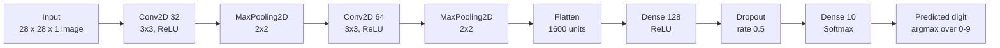
```mermaid
flowchart LR
    IN["Input<br/>28 x 28 x 1 image"] --> C1["Conv2D 32<br/>3x3, ReLU"]
    C1 --> P1["MaxPooling2D<br/>2x2"]
    P1 --> C2["Conv2D 64<br/>3x3, ReLU"]
    C2 --> P2["MaxPooling2D<br/>2x2"]
    P2 --> FL["Flatten<br/>1600 units"]
    FL --> H1["Dense 128<br/>ReLU"]
    H1 --> DR["Dropout<br/>rate 0.5"]
    DR --> OUT["Dense 10<br/>Softmax"]
    OUT --> PRED["Predicted digit<br/>argmax over 0-9"]
```

Layer summary:

| Layer             | Output shape  | Params  | Activation |
| ----------------- | ------------- | ------- | ---------- |
| Input             | (28, 28, 1)   | 0       | -          |
| Conv2D (32, 3x3)  | (26, 26, 32)  | 320     | ReLU       |
| MaxPooling2D 2x2  | (13, 13, 32)  | 0       | -          |
| Conv2D (64, 3x3)  | (11, 11, 64)  | 18496   | ReLU       |
| MaxPooling2D 2x2  | (5, 5, 64)    | 0       | -          |
| Flatten           | (1600,)       | 0       | -          |
| Dense (hidden)    | (128,)        | 204928  | ReLU       |
| Dropout (0.5)     | (128,)        | 0       | -          |
| Dense (output)    | (10,)         | 1290    | Softmax    |

Total trainable parameters: 225034. Optimizer: Adam. Loss: categorical cross-entropy.

### Tensor-shape view (how the image flows through the CNN)

The diagram below traces how the data tensor changes shape as it moves through each
layer. Unlike a fully-connected network, a CNN keeps the 2D image structure through
the convolutional part, so it is clearer to show the tensor shape at each stage than
to draw individual neuron-to-neuron weights.

- `Conv2D` layers apply small learnable 3x3 filters (kernels) across the image,
  producing one feature map per filter (32 then 64). The spatial size shrinks by 2 in
  each direction because no padding is used (26 = 28 - 2, 11 = 13 - 2).
- `MaxPooling2D 2x2` halves the height and width, keeping the strongest activation in
  each 2x2 window.
- `Flatten` turns the final 5 x 5 x 64 feature maps into a single 1600-value vector.
- `Dense 128` + `Dropout(0.5)` learn combinations of those features (dropout is active
  only during training, to reduce overfitting).
- `Dense 10 (softmax)` outputs one probability per digit; `argmax` picks the winner.


```mermaid
flowchart LR
    IN["Input<br/>(28, 28, 1)"] -->|"Conv2D 32, 3x3, ReLU"| C1["Feature maps<br/>(26, 26, 32)"]
    C1 -->|"MaxPooling2D 2x2"| P1["(13, 13, 32)"]
    P1 -->|"Conv2D 64, 3x3, ReLU"| C2["Feature maps<br/>(11, 11, 64)"]
    C2 -->|"MaxPooling2D 2x2"| P2["(5, 5, 64)"]
    P2 -->|"Flatten"| F["Vector<br/>(1600,)"]
    F -->|"Dense 128, ReLU"| H["(128,)"]
    H -->|"Dropout 0.5"| D["(128,)"]
    D -->|"Dense 10, Softmax"| O["(10,)<br/>digit probabilities"]
    O -->|"argmax"| PRED["Predicted digit 0-9"]
```

## Requirements

### Hardware requirements

- Any modern laptop or computer bought within last few years
- Any operating system (Windows 11, MacOS, Linux) which allow to install Python 3.12
- 2.5 GB free space on hard disk

### Software requirements

- **Python 3.12** is required. This project is pinned to Python **3.12.10**.
- Dependencies are pinned in [`requirements.txt`](requirements.txt):
  `tensorflow`, `pandas`, `numpy`, `scikit-learn`, `matplotlib`, plus `jupyterlab` / `ipykernel` for notebook use
- `mnist_ui_local_model.py` uses only the Python standard library (`tkinter`), so it needs no dependencies and can run on any Python that ships Tk

## Key notes

Here's some extra information:
* Access to public Internet to download GitHub repository, Python installation and Python modules
* Only CPU will be utilized
* For Linux based operating system you need graphical interface (jupyter lab will be run in web browser)
* You should not have running application which uses TCP port 8888
* If you have additional anti-virus software please make sure that it will not block URL:  http://localhost:8888/lab
* On Microsoft Windows operating system Tk packages are available out of the box after Python 3.12 installation. For Linux operating system please install below OS packages:
```bash
sudo apt install -y libfontconfig1-dev libxft-dev tk-dev tcl-dev
```

## Prepare environment for AI/ML workshop

### Prepare environment for Microsoft Windows 11 operating system

Fresh installation on Microsoft Windows 11 (no Python installation)

Open Terminal window. Type Terminal in Search textbox on taskbar:


You will get:

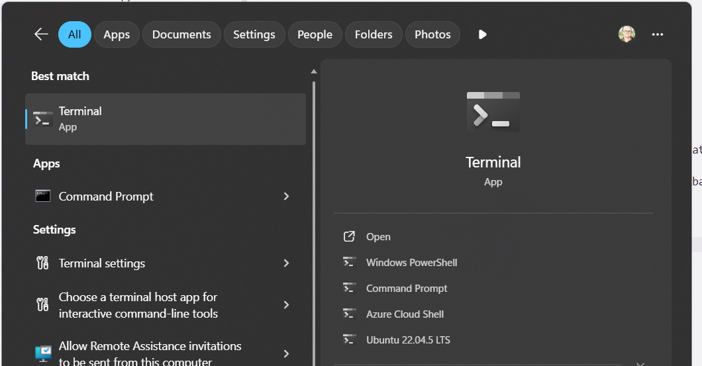

Click icon or Open hyperlink:

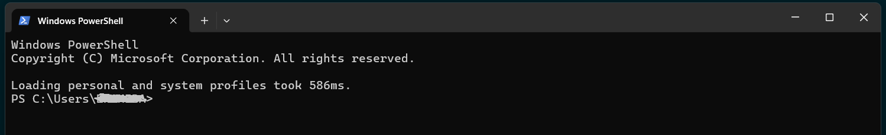

Type below command (or copy from here and paste to the Windows PowerShell terminal window):
```powershell
winget install Python.Python.3.12
```
and press Enter key:

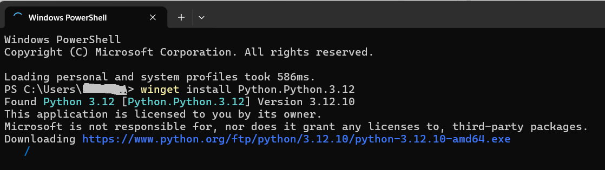

Download started (it takes 1-2 minutes), soon installation starts:

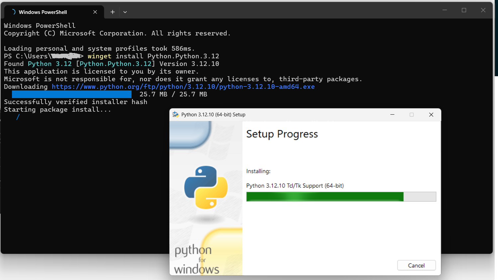

Installation takes few minutes:

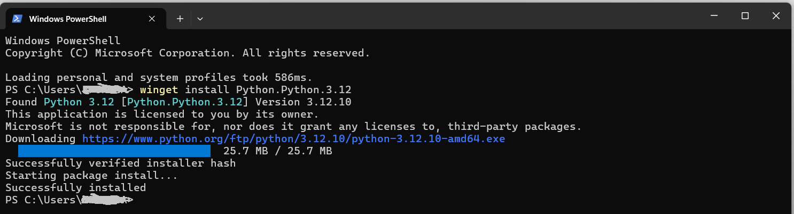

Close Terminal window (click X or type exit and press Enter key).
Open it again:


Type below command (or copy from here and paste to the Windows PowerShell terminal window):

```powershell
py -0p
```
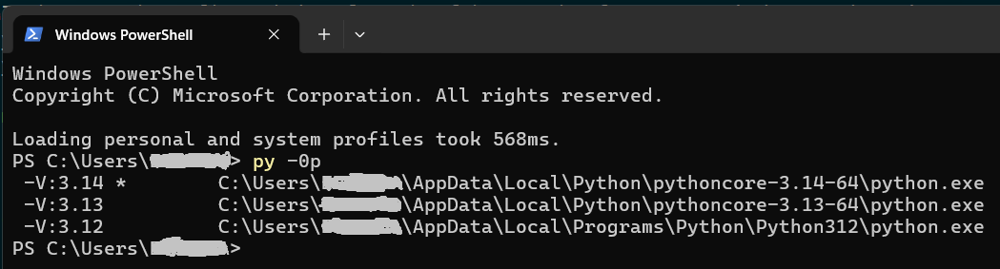

You should see line with version: 3.12.
Download git repository from GitHub web site.
Extract content of ZIP file.
Type below commands (or copy from here and paste to the Windows PowerShell terminal window):

```powershell
$zip = "$env:USERPROFILE\Downloads\it-for-she-2026-ai-workshop.zip"
Invoke-WebRequest -Uri "https://github.com/mirus2026/it-for-she-2026-ai-workshop/archive/refs/heads/main.zip" -OutFile $zip
Expand-Archive -Path $zip -DestinationPath "$env:USERPROFILE\Downloads" -Force
```

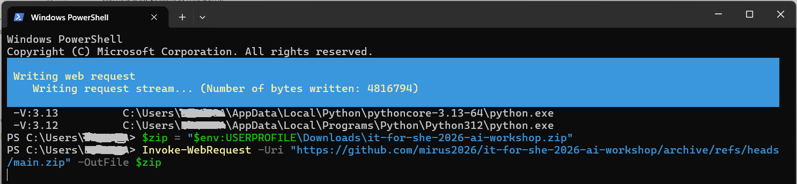

Remark: You might type Enter twice to execute all commands.

Go to folder where files were extracted.
Type below command (or copy from here and paste to the Windows PowerShell terminal window):

```powershell
cd .\Downloads\it-for-she-2026-ai-workshop-main\
```

List all files and folders in extracted folder.
Type below command (or copy from here and paste to the Windows PowerShell terminal window):

```powershell
ls
```
You should see content like below:

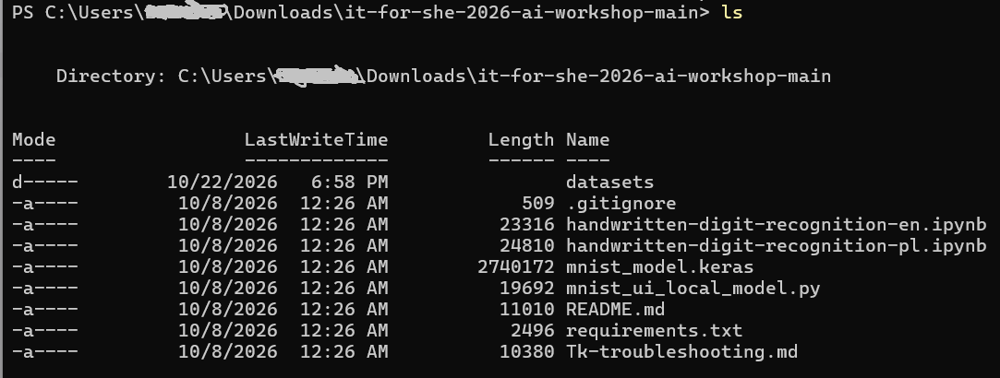

Create virtual environment.
Type below command (or copy from here and paste to the Windows PowerShell terminal window):

```powershell
py -3.12 -m venv .venv
```
If you get nothing than command was successfully executed:

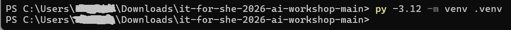

Activate virtual environment.
Type below command (or copy from here and paste to the Windows PowerShell terminal window):

```powershell
.\.venv\Scripts\Activate.ps1
```
You should see: (.venv) text:

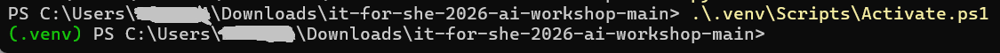

Upgrade pip command to latest version.
Type below command (or copy from here and paste to the Windows PowerShell terminal window):

```powershell
python -m pip install --upgrade pip
```
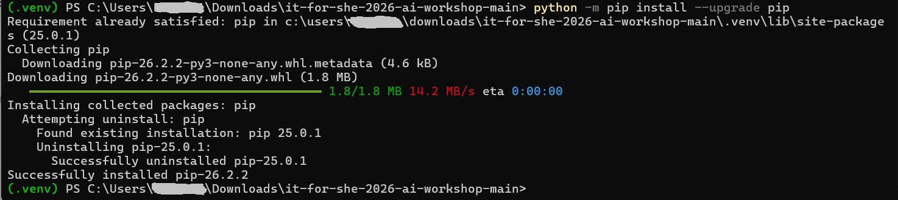

Install python modules required for Machine Learning.
Type below command (or copy from here and paste to the Windows PowerShell terminal window):

```powershell
python -m pip install -r requirements.txt
```
Installation will take approx. 5-10 minutes:

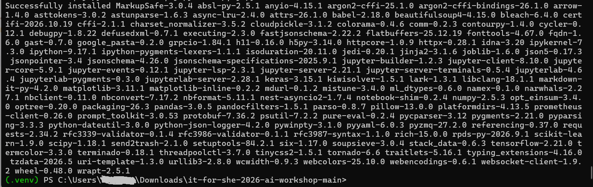

Now, you are prepared for workshop on Microsoft Windows 11 operating system!

### Prepare environment for MacOS

On bottom panel please find Terminal icon:

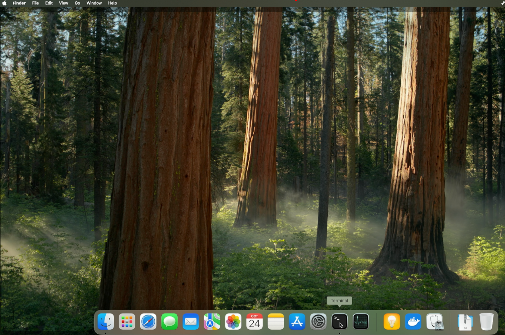

Click it, you should get Terminal window (with zsh shell):

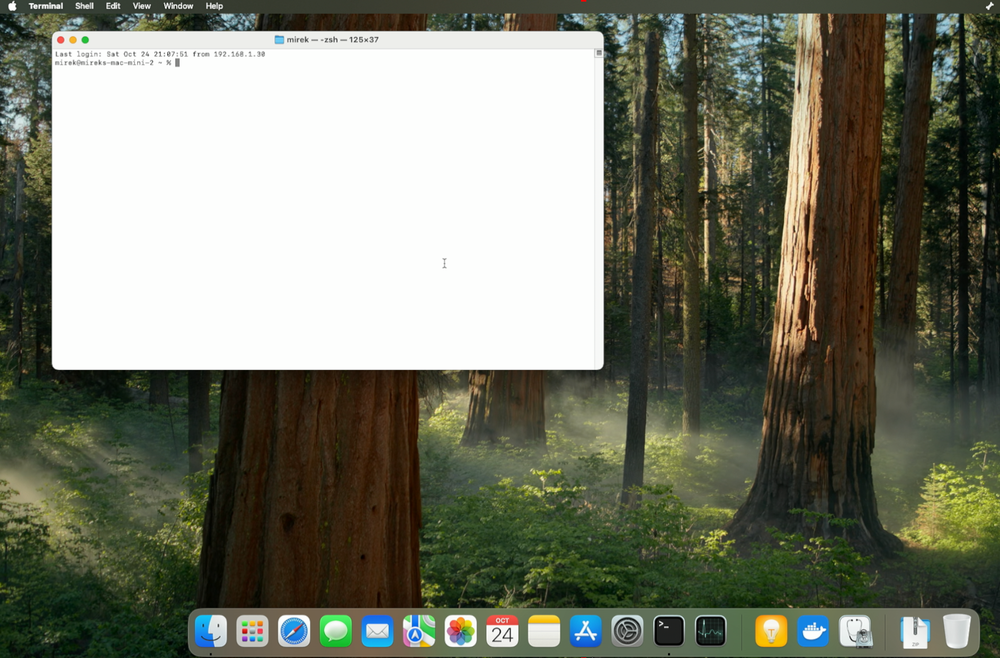

Install pyenv first. Execute below command in Terminal window:

```zsh
curl -fsSL https://pyenv.run | bash
```

Sample output from command execution is shown here:

```
Cloning into '/Users/mirek/.pyenv'...
remote: Enumerating objects: 1941, done.
remote: Counting objects: 100% (1941/1941), done.
remote: Compressing objects: 100% (801/801), done.
remote: Total 1941 (delta 1193), reused 1390 (delta 889), pack-reused 0 (from 0)
Receiving objects: 100% (1941/1941), 1.34 MiB | 7.60 MiB/s, done.
Resolving deltas: 100% (1193/1193), done.
Cloning into '/Users/mirek/.pyenv/plugins/pyenv-doctor'...
remote: Enumerating objects: 11, done.
remote: Counting objects: 100% (11/11), done.
remote: Compressing objects: 100% (9/9), done.
remote: Total 11 (delta 1), reused 5 (delta 0), pack-reused 0 (from 0)
Receiving objects: 100% (11/11), 38.72 KiB | 12.91 MiB/s, done.
Resolving deltas: 100% (1/1), done.
Cloning into '/Users/mirek/.pyenv/plugins/pyenv-update'...
remote: Enumerating objects: 10, done.
remote: Counting objects: 100% (10/10), done.
remote: Compressing objects: 100% (6/6), done.
remote: Total 10 (delta 1), reused 6 (delta 0), pack-reused 0 (from 0)
Receiving objects: 100% (10/10), done.
Resolving deltas: 100% (1/1), done.
Cloning into '/Users/mirek/.pyenv/plugins/pyenv-virtualenv'...
remote: Enumerating objects: 66, done.
remote: Counting objects: 100% (66/66), done.
remote: Compressing objects: 100% (59/59), done.
remote: Total 66 (delta 9), reused 28 (delta 0), pack-reused 0 (from 0)
Receiving objects: 100% (66/66), 49.69 KiB | 1.31 MiB/s, done.
Resolving deltas: 100% (9/9), done.

WARNING: seems you still have not added 'pyenv' to the load path.

# Load pyenv automatically by appending
# the following to
# ~/.bash_profile if it exists, otherwise ~/.profile (for login shells)
# and ~/.bashrc (for interactive shells) :

export PYENV_ROOT="$HOME/.pyenv"
[[ -d $PYENV_ROOT/bin ]] && export PATH="$PYENV_ROOT/bin:$PATH"
eval "$(pyenv init - bash)"

# Restart your shell for the changes to take effect.

# Load pyenv-virtualenv automatically by adding
# the following to ~/.bashrc:

eval "$(pyenv virtualenv-init -)"
```

For bash shell add below lines to `$HOME/.bashrc` file:

```
export PYENV_ROOT="$HOME/.pyenv"
[[ -d $PYENV_ROOT/bin ]] && export PATH="$PYENV_ROOT/bin:$PATH"
eval "$(pyenv init - bash)"
```
For zsh shell add below lines to `$HOME/.zshrc` file:

```
export PYENV_ROOT="$HOME/.pyenv"
[[ -d $PYENV_ROOT/bin ]] && export PATH="$PYENV_ROOT/bin:$PATH"
eval "$(pyenv init - zsh)"
```

Restart your shell for the changes to take effect (logout / login).

Use pyenv to install Python 3.12.10 without touching the system Python.
Execute below command in Terminal window:

```zsh
pyenv install 3.12.10
```
Download and installation will take several minutes.
In last line of sample output of command execution, you should see text: `Installed Python-3.12.10`:

```text
python-build: use openssl@3 from homebrew
python-build: use readline from homebrew
Downloading Python-3.12.10.tar.xz...
-> https://www.python.org/ftp/python/3.12.10/Python-3.12.10.tar.xz
  % Total    % Received % Xferd  Average Speed   Time    Time     Time  Current
                                 Dload  Upload   Total   Spent    Left  Speed
100 19.5M  100 19.5M    0     0  18.0M      0  0:00:01  0:00:01 --:--:-- 18.0M
Installing Python-3.12.10...
patching file 'Misc/NEWS.d/next/macOS/2026-08-05-02-02-33.gh-issue-153711.pO9fFb.rst'
patching file configure
patching file configure.ac
python-build: use tcl-tk@8 from homebrew
python-build: use readline from homebrew
python-build: use zlib from xcode sdk
Installed Python-3.12.10 to /Users/mirek/.pyenv/versions/3.12.10
```

You should select Python 3.12.10.
Execute below command in Terminal window:

```zsh
pyenv local 3.12.10
```
No output from command execution means that it was executed properly.

```zsh
python --version
```

You should see: `Python 3.12.10`

If not than execute below command in Terminal window:

```zsh
unalias python
```

Download git repository.
Please execute below command in Terminal window:

```zsh
curl -L "https://github.com/mirus2026/it-for-she-2026-ai-workshop/archive/refs/heads/main.zip" -o it-for-she-2026-ai-workshop.zip
```

Extract content of ZIP file.
Please execute below command in Terminal window:

```zsh
unzip it-for-she-2026-ai-workshop.zip
```

You should see output like:

```
Archive:  it-for-she-2026-ai-workshop.zip
3f14088b1d8c6e2edec7a16927f35f531c95d416
   creating: it-for-she-2026-ai-workshop-main/
  inflating: it-for-she-2026-ai-workshop-main/.gitignore
  inflating: it-for-she-2026-ai-workshop-main/README.md
  inflating: it-for-she-2026-ai-workshop-main/Tk-troubleshooting.md
   creating: it-for-she-2026-ai-workshop-main/datasets/
  inflating: it-for-she-2026-ai-workshop-main/datasets/Train.csv
  inflating: it-for-she-2026-ai-workshop-main/datasets/test.csv
   creating: it-for-she-2026-ai-workshop-main/docs/
   creating: it-for-she-2026-ai-workshop-main/docs/img/
  inflating: it-for-she-2026-ai-workshop-main/docs/img/DownloadExtractGitRepo.png
  inflating: it-for-she-2026-ai-workshop-main/docs/img/ExtractedFolderContent.png
  inflating: it-for-she-2026-ai-workshop-main/docs/img/JupyterLabLauncher.png
  inflating: it-for-she-2026-ai-workshop-main/docs/img/JupyterLabNotebookOpened.png
  inflating: it-for-she-2026-ai-workshop-main/docs/img/JupyterLabWindows.png
  inflating: it-for-she-2026-ai-workshop-main/docs/img/ListOfPythonVersions.png
  inflating: it-for-she-2026-ai-workshop-main/docs/img/MNIST-Paint-6digit.png
  inflating: it-for-she-2026-ai-workshop-main/docs/img/MNIST-Paint-UI.png
  inflating: it-for-she-2026-ai-workshop-main/docs/img/PipUpgrade.png
  inflating: it-for-she-2026-ai-workshop-main/docs/img/PythonInstallationCompleted.png
  inflating: it-for-she-2026-ai-workshop-main/docs/img/PythonInstallationProgress.png
  inflating: it-for-she-2026-ai-workshop-main/docs/img/PythonModulesInstalled.png
  inflating: it-for-she-2026-ai-workshop-main/docs/img/TerminalApp.png
  inflating: it-for-she-2026-ai-workshop-main/docs/img/TerminalWindow.png
  inflating: it-for-she-2026-ai-workshop-main/docs/img/VirtEnvActivated.png
  inflating: it-for-she-2026-ai-workshop-main/docs/img/VirtualEnvCreated.png
  inflating: it-for-she-2026-ai-workshop-main/docs/img/WingetPythonCmd.png
  inflating: it-for-she-2026-ai-workshop-main/docs/img/win-taskbar.png
  inflating: it-for-she-2026-ai-workshop-main/handwritten-digit-recognition-en.ipynb
  inflating: it-for-she-2026-ai-workshop-main/handwritten-digit-recognition-pl.ipynb
  inflating: it-for-she-2026-ai-workshop-main/mnist_model.keras
  inflating: it-for-she-2026-ai-workshop-main/mnist_ui_local_model.py
  inflating: it-for-she-2026-ai-workshop-main/requirements.txt
```

Go to folder where files were extracted.
Please execute below command in Terminal window:

```zsh
cd it-for-she-2026-ai-workshop-main
```

Create Python virtual environment.
Please execute below command in Terminal window:

```zsh
python -m venv .venv
```

Active Python virtual environment.
Please execute below command in Terminal window:

```zsh
source .venv/bin/activate
```
You should see `((.venv) )` prefix in shell prompt.

Upgrade pip module.
Please execute below command in Terminal window:

```zsh
python -m pip install --upgrade pip
```

You should see command output similiar to:

```text
Requirement already satisfied: pip in ./.venv/lib/python3.12/site-packages (25.0.1)
Collecting pip
  Downloading pip-26.2.2-py3-none-any.whl.metadata (4.6 kB)
Downloading pip-26.2.2-py3-none-any.whl (1.8 MB)
   ━━━━━━━━━━━━━━━━━━━━━━━━━━━━━━━━━━━━━━━━ 1.8/1.8 MB 17.4 MB/s eta 0:00:00
Installing collected packages: pip
  Attempting uninstall: pip
    Found existing installation: pip 25.0.1
    Uninstalling pip-25.0.1:
      Successfully uninstalled pip-25.0.1
Successfully installed pip-26.2.2
```

Install Python modules.
Please execute below command in Terminal window:

```bash
python -m pip install -r requirements.txt
```

Installation will take several minutes.
You should get output like:

```text
Successfully installed MarkupSafe-3.0.4 absl-py-2.5.1 anyio-4.15.1 appnope-1.0.0 argon2-cffi-25.1.0 argon2-cffi-bindings-26.1.0 arrow-1.4.0 asttokens-3.0.2 astunparse-1.6.3 async-lru-2.4.0 attrs-26.1.0 babel-2.18.0 beautifulsoup4-4.15.0 bleach-6.4.0 certifi-2026.10.23 cffi-2.1.1 charset_normalizer-3.5.2 cloudpickle-3.1.2 comm-0.2.3 contourpy-1.4.0 cycler-0.12.1 debugpy-1.8.22 defusedxml-0.7.1 executing-2.3.0 fastjsonschema-2.22.2 flatbuffers-25.12.19 fonttools-4.67.0 fqdn-1.6.0 gast-0.7.0 google_pasta-0.2.0 grpcio-1.84.1 h11-0.16.0 h5py-3.14.0 httpcore-1.0.9 httpx-0.28.1 idna-3.20 ipykernel-7.3.0 ipython-9.17.1 ipython-pygments-lexers-1.1.1 isoduration-20.11.0 jedi-0.20.1 jinja2-3.1.6 joblib-1.6.0 json5-0.17.3 jsonpointer-3.4 jsonschema-4.26.0 jsonschema-specifications-2025.9.1 jupyter-builder-1.2.3 jupyter-client-8.10.0 jupyter-core-5.9.1 jupyter-events-0.12.1 jupyter-lsp-2.3.1 jupyter-server-2.21.1 jupyter-server-terminals-0.5.4 jupyterlab-4.6.4 jupyterlab-pygments-0.3.0 jupyterlab-server-2.28.1 keras-3.15.1 kiwisolver-1.5.1 lark-1.3.1 libclang-18.1.1 markdown-it-py-4.2.0 matplotlib-3.11.1 matplotlib-inline-0.2.2 mdurl-0.1.2 mistune-3.4.0 ml_dtypes-0.6.0 namex-0.1.0 narwhals-2.27.1 nbclient-0.11.0 nbconvert-7.17.2 nbformat-5.11.1 nest-asyncio2-1.7.4 notebook-shim-0.2.4 numpy-2.5.3 opt_einsum-3.4.0 optree-0.20.0 packaging-26.3 pandas-3.0.5 pandocfilters-1.5.1 parso-0.8.7 pexpect-4.9.0 pillow-13.0.0 platformdirs-4.13.5 prometheus-client-0.26.0 prompt_toolkit-3.0.53 protobuf-7.36.2 psutil-7.2.2 ptyprocess-0.7.0 pure-eval-0.2.4 pycparser-3.12 pygments-2.21.0 pyparsing-3.3.3 python-dateutil-3.0.0 python-json-logger-4.2.0 pyyaml-6.0.3 pyzmq-27.2.0 referencing-0.37.0 requests-2.34.2 rfc3339-validator-0.1.4 rfc3986-validator-0.1.1 rfc3987-syntax-1.1.0 rich-15.0.0 rpds-py-2026.9.1 scikit-learn-1.9.0 scipy-1.18.1 send2trash-2.1.0 setuptools-84.2.1 six-1.17.0 soupsieve-3.0.4 stack_data-0.6.3 tensorflow-2.21.0 termcolor-3.3.0 terminado-0.18.1 threadpoolctl-3.7.0 tinycss2-1.5.1 tornado-6.6 traitlets-5.16.1 typing_extensions-4.16.0 tzdata-2026.5 uri-template-1.3.0 urllib3-2.8.0 wcwidth-0.9.4 webcolors-25.10.0 webencodings-0.6.1 websocket-client-1.9.2 wheel-0.48.0 wrapt-2.5.1
```

Now, you are prepared for workshop on MacOS operating system!

### Prepare environment for Linux

Install pyenv first (https://github.com/pyenv/pyenv#installation)

```bash
curl -fsSL https://pyenv.run | bash
```

Add below lines to: $USER/.bashrc file:

export PYENV_ROOT="$HOME/.pyenv"
[[ -d $PYENV_ROOT/bin ]] && export PATH="$PYENV_ROOT/bin:$PATH"
eval "$(pyenv init - bash)"

Restart your shell for the changes to take effect (logout / login).

Use pyenv to install Python 3.12.10 without touching the system Python:

```bash
pyenv install 3.12.10
```
Download and installation will take several minutes.
You should see:

```text
Downloading Python-3.12.10.tar.xz...
-> https://www.python.org/ftp/python/3.12.10/Python-3.12.10.tar.xz
Installing Python-3.12.10...
Installed Python-3.12.10 to /home/mirek/.pyenv/versions/3.12.10
```
You should select Python 3.12.10:

```bash
pyenv local 3.12.10
```

No output from command execution means that it was executed properly.

```bash
python --version
```

Last command should print: Python 3.12.10

Download git repository:

```bash
curl -L "https://github.com/mirus2026/it-for-she-2026-ai-workshop/archive/refs/heads/main.zip" -o it-for-she-2026-ai-workshop.zip
```

Extract content of ZIP file:

```bash
unzip it-for-she-2026-ai-workshop.zip
```

Go to folder where files were extracted:

```bash
cd it-for-she-2026-ai-workshop-main
```

Create virtual environment:

```bash
python -m venv .venv
```

Active virtual environment:

```bash
source .venv/bin/activate
```

Upgrade pip module:

```bash
python -m pip install --upgrade pip
```

Install Python modules:

```bash
python -m pip install -r requirements.txt
```


## Run the notebook interactively (JupyterLab)

`handwritten-digit-recognition-en.ipynb` is the step-by-step notebook version of the
training script. To run it interactively:

1. Start JupyterLab from the project root (it opens your browser at
   `http://localhost:8888/lab`; the terminal also prints the URL with an access token):

   On Microsoft Windows:

   ```powershell
   .\.venv\Scripts\jupyter lab
   ```
   On MacOS / Linux:

   ```bash
   .venv/bin/jupyter lab
   ```

You should see output like (example for Microsoft Windows operating system):

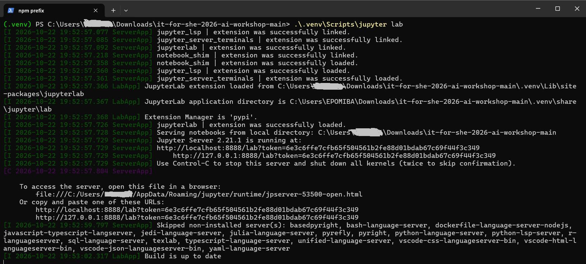

Default web browser will be open with page:

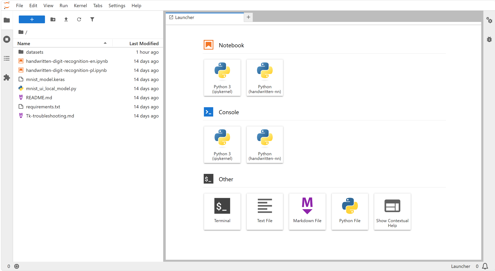

2. In the left file browser, double-click `handwritten-digit-recognition-en.ipynb`

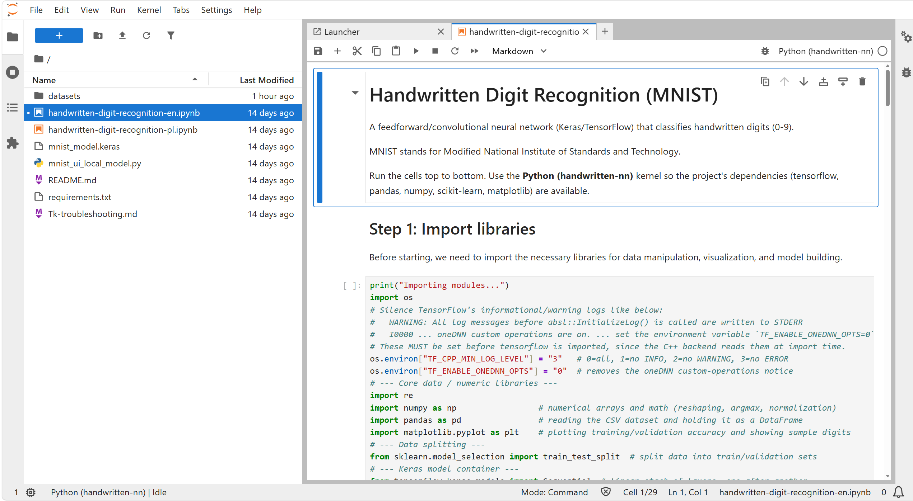


3. Confirm the kernel (top-right of the notebook) is **Python (handwritten-nn)** so the
   venv's packages are used. If it shows a different kernel, click it and switch.
4. Run cells in order (they depend on each other):
   - `Shift+Enter` runs the current cell and moves to the next.
   - `Ctrl+Enter` runs the current cell and stays.
   - Or use the "Run" menu -> "Run All Cells" to execute the whole notebook.

   Step 7 (training) is the slow cell - it runs the full training and may take a few
   minutes on CPU; a `[*]` next to the cell means it is still running. Plots render
   inline, no separate windows.

To stop the server, press `Ctrl+C` twice in the terminal where you launched it.

Note: running Steps 7 and 9 retrains the model and **overwrites `mnist_model.keras`**.
Back up that file first if you want to keep the current model.

### Clear notebook outputs

To strip all cell outputs (printed text, plots, execution counts) from the notebook
- for a clean file before committing - run:

```powershell
.\.venv\Scripts\jupyter nbconvert --clear-output --inplace handwritten-digit-recognition-en.ipynb
.\.venv\Scripts\jupyter nbconvert --clear-output --inplace handwritten-digit-recognition-pl.ipynb
```

## Run MNIST Paint UI demo application using local model

Execute below command:

```powershell
python mnist_ui_local_model.py
```

It will take couple of seconds to start because local model must be loaded to memory.

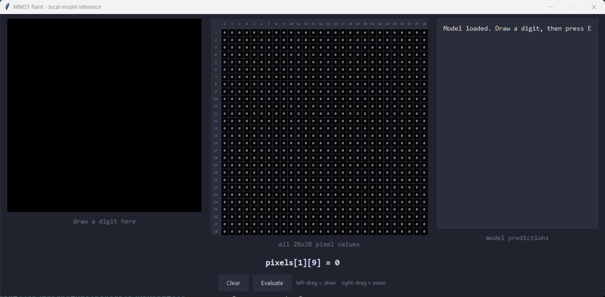

Draw digit in left panel and click Evaluate button:

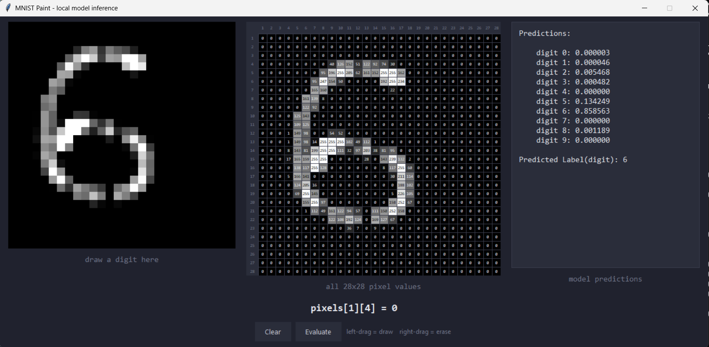

You should see probability of predicted digit.

## Reference material

* [Handwritten Digit Recognition using Neural Network](https://www.geeksforgeeks.org/machine-learning/handwritten-digit-recognition-using-neural-network/)
